# ☕ Java Learning Project: A Beginner's Guide to Spring Boot

<div align="center">


</div>

---

## 🌟 Welcome to Your Java Journey!

🚀 **Ready to dive into modern Java development?** This project is your launchpad into the exciting world of Spring Boot! We'll guide you from absolute basics to advanced features, building real-world applications that will set you up for success in your software development career.

### 🎯 What You'll Learn:
- 🏗️ **Spring Boot Fundamentals** - Build robust web applications
- 🔐 **Security & Authentication** - Protect your applications with JWT
- 🗄️ **Database Management** - Master JPA, Hibernate, and PostgreSQL
- 🌐 **RESTful APIs** - Create clean, documented APIs with Swagger
- 🏗️ **Clean Architecture** - Learn industry best practices
- 🔧 **Modern Development Tools** - Maven, H2, and more!

## 🚀 Getting Started: Running the Application

Follow these simple steps to get your development environment up and running!

### 📋 Prerequisites

Before we begin, make sure you have these tools installed:

| Tool | Version | Description | Download Link |
|------|---------|-------------|---------------|
| ☕ **Java JDK** | 17+ | The foundation of our application | [Download](https://adoptium.net/) |
| 📦 **Maven** | 3.6+ | Dependency management (bundled with IDEs) | [Download](https://maven.apache.org/) |
| 💻 **IDE** | Latest | IntelliJ IDEA, VS Code, or Eclipse | [IntelliJ](https://www.jetbrains.com/idea/) \| [VS Code](https://code.visualstudio.com/) |
| 🐘 **PostgreSQL** | 13+ | Production database (optional for local dev) | [Download](https://www.postgresql.org/) |

### ⚙️ Configuration Options

We've made it super easy to get started! Choose your preferred setup:

<div align="center">

| 🟢 **Quick Start (H2 Database)** | 🔵 **Production Setup (PostgreSQL)** |
|-----------------------------------|--------------------------------------|
| ✅ No database installation needed | ✅ Production-ready configuration |
| ✅ Automatic setup | ✅ Persistent data storage |
| ✅ Perfect for learning | ✅ Real-world experience |

</div>

#### 🟢 Option 1: Quick Start with H2 (Recommended for Beginners)

**Perfect for learning!** 🎓 This project comes pre-configured with H2 in-memory database:
- ✨ **Zero configuration** - just run and go!
- 🔄 **Auto-refresh** - database resets on each restart
- 🌐 **Built-in console** - view your data at `http://localhost:8080/h2-console`

#### 🔵 Option 2: Production Setup with PostgreSQL

Ready for the real deal? Here's how to set up PostgreSQL:

1. **🗄️ Create Database:**
   ```sql
   CREATE DATABASE java_learning_db;
   ```

2. **📝 Update Configuration:**
   Edit `src/main/resources/application.properties`:
   ```properties
   spring.datasource.url=jdbc:postgresql://localhost:5432/java_learning_db
   spring.datasource.username=your_username
   spring.datasource.password=your_password
   spring.jpa.hibernate.ddl-auto=update
   ```

#### 📥 Clone & Setup

```bash
git clone https://github.com/Arcares125/java-beginner.git
cd java-beginner
```

### 🏃‍♂️ Running the Application

Choose your preferred method to start the application:

<div align="center">

| 🖥️ **IDE Method** | ⌨️ **Command Line** |
|-------------------|---------------------|
| Perfect for debugging | Great for quick starts |
| Visual interface | Terminal lovers |

</div>

#### 🖥️ Method 1: Using Your IDE

1. **📂 Open Project** - Import the project into your IDE
2. **🎯 Find Main Class** - Navigate to:
   ```
   src/main/java/com/learning/java_learning/JavaLearningApplication.java
   ```
3. **▶️ Run** - Right-click → "Run JavaLearningApplication"

#### ⌨️ Method 2: Command Line

```bash
# 🐧 Linux/Mac
./mvnw spring-boot:run

# 🪟 Windows
mvnw.cmd spring-boot:run
```

### 🎉 Success! 

When you see this message, you're ready to go:
```
🚀 Started JavaLearningApplication in X.XXX seconds
```

### 🌐 Explore Your Application

Now the fun begins! Here's what you can access:

<div align="center">

| 🔗 **Service** | 🌍 **URL** | 📋 **Description** |
|---------------|------------|-------------------|
| 📖 **API Documentation** | [`localhost:8080/swagger-ui.html`](http://localhost:8080/swagger-ui.html) | Interactive API explorer with Swagger |
| 🗄️ **Database Console** | [`localhost:8080/h2-console`](http://localhost:8080/h2-console) | Direct database access and SQL queries |

</div>

#### 📖 Swagger API Documentation
🔥 **Your interactive API playground!**
- ✅ Test all endpoints directly in the browser
- 📝 Detailed request/response examples
- 🔐 Built-in authentication testing

#### 🗄️ H2 Database Console
🔍 **Peek under the hood!**

**Connection Settings:**
```
🔗 JDBC URL: jdbc:h2:mem:java_learning_db
👤 Username: sa
🔐 Password: (leave blank)
```

**What you can do:**
- 📊 View all tables (`USER`, `BLOG`, `COMMENT`, etc.)
- 🔍 Run custom SQL queries
- 📈 Monitor data changes in real-time

## 🚀 Productivity Tips & AI-Powered Code Generation

### 🤖 Using Cursor's AI Superpowers

Boost your productivity with these AI-assisted shortcuts! 💨

1. **Entity Generation:**
   - Type `@Entity` and press Tab
   - Or use the command: `Ctrl+K` (Cmd+K on Mac) and type "create JPA entity with fields: [your fields]"
   - Example: "create JPA entity with fields: id (Long), name (String), email (String), createdAt (LocalDateTime)"

2. **Repository Generation:**
   - Type `@Repository` and press Tab
   - Or use `Ctrl+K` and type "create Spring Data JPA repository for [entity name]"

3. **Service Layer:**
   - Type `@Service` and press Tab
   - Or use `Ctrl+K` and type "create service class with CRUD methods for [entity name]"

4. **Controller Generation:**
   - Type `@RestController` and press Tab
   - Or use `Ctrl+K` and type "create REST controller with CRUD endpoints for [entity name]"

### Common Code Templates

Here are some useful code templates you can type followed by Tab:

```java
// Entity templates
@entity         -> Creates basic entity class structure
@table          -> Adds table configuration
@column         -> Adds column configuration
@manytoone      -> Adds Many-to-One relationship
@onetomany      -> Adds One-to-Many relationship

// Repository templates
@repo           -> Creates JPA repository interface
@query          -> Adds custom query method

// Service templates
@service        -> Creates service class structure
@transactional  -> Adds transaction configuration

// Controller templates
@restcontroller -> Creates REST controller structure
@getmapping     -> Adds GET endpoint
@postmapping    -> Adds POST endpoint
@putmapping     -> Adds PUT endpoint
@deletemapping  -> Adds DELETE endpoint
```

### Using AI for Complex Tasks

For more complex code generation, you can use Cursor's AI features:

1. **Press `Ctrl+K` (Cmd+K on Mac) and describe what you want:**
   - "Create a complete entity class for User with validation annotations"
   - "Generate CRUD repository methods with custom queries"
   - "Create a service method that implements pagination"

2. **Inline Code Generation (Press Tab after typing):**
   - Type `getter` -> Generates getter methods
   - Type `setter` -> Generates setter methods
   - Type `constructor` -> Generates constructor
   - Type `builder` -> Generates builder pattern code

3. **Documentation Generation:**
   - Type `javadoc` and press Tab -> Generates documentation template
   - Or use `Ctrl+K` and type "add javadoc to this class/method"

Remember to review and adjust the generated code as needed. The AI is a helpful tool but might need fine-tuning to match your specific requirements.

## 🗺️ Your Learning Roadmap

Embark on your journey from Java novice to Spring Boot hero! 🦸‍♀️

```mermaid
graph LR
    A[🏁 Start Here] --> B[📝 Blog CRUD]
    B --> C[💬 Comments System]
    C --> D[🔐 Authentication]
    D --> E[🚀 Advanced Features]
    
    style A fill:#e1f5fe
    style B fill:#f3e5f5
    style C fill:#e8f5e8
    style D fill:#fff3e0
    style E fill:#fce4ec
```

<div align="center">



</div>

### 🎯 Learning Milestones

| 🎲 **Level** | 📚 **Topic** | 🎯 **Goal** | ⏱️ **Time** |
|-------------|-------------|-------------|-------------|
| 🟢 **Beginner** | Blog CRUD System | Master the fundamentals | 2-3 hours |
| 🟡 **Intermediate** | Comment Feature | Build your first feature | 3-4 hours |
| 🟠 **Advanced** | User Authentication | Secure your application | 4-5 hours |
| 🔴 **Expert** | Real-time Features | WebSockets & External APIs | 6+ hours |

### 🏗️ What We'll Build Together

1. **🏛️ Foundation (Blog System)** - Your gateway to understanding:
   - 🗄️ **Database Entities** - How data is structured
   - 🔄 **CRUD Operations** - Create, Read, Update, Delete
   - 🌐 **RESTful APIs** - How applications communicate
   - 📖 **Documentation** - Professional API docs with Swagger

2. **🔨 Hands-On Practice (Comment System)** - Build confidence by creating:
   - 💬 **Comment Entity** - Practice database relationships
   - 🔗 **API Endpoints** - Master request/response patterns
   - 🧪 **Testing** - Ensure your code works perfectly

3. **🛡️ Security Mastery** - Protect your applications:
   - 🔐 **JWT Authentication** - Industry-standard security
   - 👥 **User Roles** - Control access to features
   - 🔒 **Route Protection** - Secure sensitive endpoints

4. **🚀 Advanced Adventures** - Level up your skills:
   - 🌐 **OAuth Integration** - Connect with external services
   - ⚡ **Real-time Updates** - WebSockets and Kafka
   - 📊 **Performance** - Optimize for production

## 📝 Our First Feature: The Blog System

Welcome to your first real-world Spring Boot feature! 🎉

We've built a complete blog system that showcases the power and elegance of modern Java development. This isn't just a demo - it's production-ready code that follows industry best practices!

### How It Works: The Layers of the Application

*   **`BlogController.java` (`controller` package):** This is the front door to our feature. It defines the API endpoints (URLs) that the outside world can interact with (e.g., `/api/blogs`). When a request comes in, the controller calls the appropriate method in the `BlogService`.
*   **`BlogService.java` (`service` package):** This is the brain of our feature. It contains the business logic. For example, the `createBlog` method takes the data from the controller, creates a new `Blog` object, and tells the `BlogRepository` to save it.
*   **`BlogRepository.java` (`repository` package):** This is the component that talks to the database. It extends `JpaRepository`, which gives us a set of ready-to-use methods for database operations (`save()`, `findById()`, `findAll()`, etc.).
*   **`Blog.java` (`entity` package):** This is the blueprint for our `blogs` table in the database. Each field in this class (e.g., `title`, `content`) corresponds to a column in the table.
*   **`BlogRequest.java` (`dto.request` package):** This is a Data Transfer Object (DTO). We use it to shape the data that we expect to receive in an API request. It ensures that users can't pass in fields we don't want them to (like the `createdAt` timestamp).

### A Note on Best Practices: The Order of Creation

When you build your own features, following a "bottom-up" approach is highly recommended. The order above explains how the pieces connect, but here is the best order to **create** the files for a new feature:

1.  **Entity:** Define your data structure first.
2.  **DTOs:** Define how your data will look for API requests and responses.
3.  **Repository:** Create the interface to access the data in the database.
4.  **Service:** Write the business logic that uses the repository.
5.  **Controller:** Expose your service's logic to the world via API endpoints.

---

## 💪 Your First Coding Challenges

Time to roll up your sleeves and become a Spring Boot developer! 🔥

These carefully crafted exercises will transform you from a beginner into a confident Java developer. Each challenge builds upon the previous one, ensuring you master the fundamentals while having fun!

### 🏗️ Exercise 1: Create a `Comment` Entity

**🎯 Mission:** Build your first entity from scratch and master database relationships!

**🎮 Challenge Level:** 🟢 Beginner  
**⏱️ Estimated Time:** 30-45 minutes  
**🏆 Reward:** Understanding of JPA entities and relationships

<div align="center">

| 📋 **Task** | 🎯 **Objective** | 💡 **Learning Goal** |
|------------|------------------|----------------------|
| Create Entity | Build `Comment.java` | JPA entity structure |
| Add Fields | Define data model | Field types & annotations |
| Link to Blog | Create relationship | Database relationships |

</div>

#### 🚀 Your Mission:

1. **📁 Create `Comment.java`** in the `entity` package
2. **🏗️ Add These Fields:**
   ```java
   💎 id (Long, Primary Key, GeneratedValue)
   📝 content (String, cannot be null)
   👤 author (String)
   📅 createdAt, updatedAt (like in Blog entity)
   ```

3. **🔗 Connect to Blog Entity:**
   - 💡 **Pro Tip:** Use `@ManyToOne` annotation
   - 🔧 **Bonus:** Add `@JoinColumn(name = "blog_id")` for the foreign key
   - 🎯 **Goal:** One blog can have many comments!

### 🔧 Exercise 2: Build the `Comment` CRUD Logic

**🎯 Mission:** Create the complete comment management system!

**🎮 Challenge Level:** 🟡 Intermediate  
**⏱️ Estimated Time:** 60-90 minutes  
**🏆 Reward:** Mastery of the Spring Boot architecture layers

<div align="center">

| 🏗️ **Component** | 📍 **Location** | 🎯 **Purpose** |
|------------------|----------------|----------------|
| Repository | `repository` package | Database operations |
| Service | `service` package | Business logic |
| Controller | `controller` package | API endpoints |
| DTO | `dto.request` package | Data transfer |

</div>

#### 🚀 Your Mission Steps:

1. **🗄️ Create `CommentRepository.java`**
   ```java
   // Extend JpaRepository<Comment, Long>
   // 🎯 Goal: Database access layer
   ```

2. **⚙️ Build `CommentService.java`** with these methods:
   - 📖 `getCommentsForBlog(Long blogId)`
   - ➕ `addCommentToBlog(Long blogId, CommentRequest request)`

3. **🌐 Create `CommentController.java`**
   - 📍 Map to: `/api/blogs/{blogId}/comments`
   - 🔗 Connect your service methods to HTTP endpoints

4. **📦 Design `CommentRequest` DTO**
   - 🎯 Structure the data for new comments
   - 💡 Keep it simple and focused!

### 🛡️ Exercise 3: Introduction to Security

**🎯 Mission:** Secure your application like a pro!

**🎮 Challenge Level:** 🟠 Advanced  
**⏱️ Estimated Time:** 15-30 minutes  
**🏆 Reward:** Understanding of role-based access control

<div align="center">

| 🔒 **Security Feature** | 🎯 **Goal** | 💡 **Real-World Use** |
|------------------------|-------------|----------------------|
| Role-based Access | Protect admin operations | Enterprise applications |
| Method Security | Fine-grained control | Sensitive operations |
| JWT Authentication | Stateless security | Modern web apps |

</div>

#### 🚀 Your Mission:

**🎯 Goal:** Only ADMIN users can delete blog posts

1. **📍 Navigate to** `BlogController.java`
2. **🔍 Find** the `deleteBlog` method
3. **🔒 Add Security:**
   ```java
   @PreAuthorize("hasRole('ADMIN')")
   ```
4. **✅ Verify** `@EnableMethodSecurity` exists in `SecurityConfig.java`

#### 🧪 Test Your Security:
- 🟢 **Admin user** → ✅ Can delete blogs
- 🔴 **Regular user** → ❌ Gets "Forbidden" error

---

## 🎉 Congratulations, Future Developer!

You're now equipped with the fundamentals of Spring Boot development! 🚀

**🎯 Remember:** Great developers are built one line of code at a time. Keep practicing, stay curious, and most importantly - have fun building amazing things! 💪

### 🤝 Need Help?
- 💬 Check the code comments for guidance
- 🔍 Use your IDE's autocomplete features
- 📖 Refer back to the examples in this README
- 🤖 Leverage Cursor's AI assistance

**Happy coding!** 🎊

## JPA Entity Guide

### Field Validations

Here's a comprehensive guide to field validations in JPA entities:

| Annotation | Use Case | Example | Description |
|------------|----------|---------|-------------|
| `@NotNull` | Basic null check | `@NotNull(message = "Field cannot be null")` | Ensures value is not null |
| `@NotBlank` | String content check | `@NotBlank(message = "Name is required")` | Ensures string has content (not null or empty) |
| `@NotEmpty` | Collection/Array check | `@NotEmpty(message = "List cannot be empty")` | Ensures collection/array is not empty |
| `@Size` | Length/size constraints | `@Size(min = 2, max = 50)` | Validates length of strings or size of collections |
| `@Min` | Minimum number value | `@Min(value = 0)` | Validates minimum number value |
| `@Max` | Maximum number value | `@Max(value = 100)` | Validates maximum number value |
| `@Email` | Email format | `@Email(message = "Invalid email")` | Validates email format |
| `@Pattern` | Regex pattern | `@Pattern(regexp = "^[A-Za-z0-9]*$")` | Validates string against regex pattern |
| `@DecimalMin` | Minimum decimal | `@DecimalMin("0.01")` | Validates minimum decimal value |
| `@DecimalMax` | Maximum decimal | `@DecimalMax("999.99")` | Validates maximum decimal value |
| `@Digits` | Number format | `@Digits(integer = 6, fraction = 2)` | Validates number of digits |

### JPA Relationships and Fetch Types

Understanding when to use different fetch types is crucial for application performance:

| Relationship | Fetch Type | Use Case | Example |
|-------------|------------|-----------|---------|
| `@OneToOne` | EAGER | When child entity is essential and small | User -> UserProfile |
| `@OneToOne` | LAZY | When child entity is large or rarely needed | User -> UserSettings |
| `@OneToMany` | LAZY (Always!) | Collection of child entities | Blog -> Comments |
| `@ManyToOne` | EAGER | When parent entity is essential | Comment -> Author |
| `@ManyToOne` | LAZY | When parent entity is large | Comment -> Blog |
| `@ManyToMany` | LAZY (Always!) | Many-to-many relationships | User -> Roles |

### Real-World Examples

#### 1. Blog with Comments (One-to-Many)
```java
@Entity
public class Blog {
    @Id
    private Long id;
    
    @NotBlank
    @Size(min = 5, max = 200)
    private String title;
    
    // EAGER: Author is small and frequently needed
    @ManyToOne(fetch = FetchType.EAGER)
    private User author;
    
    // LAZY: Comments could be numerous
    @OneToMany(mappedBy = "blog", fetch = FetchType.LAZY)
    private List<Comment> comments;
}

@Entity
public class Comment {
    @Id
    private Long id;
    
    @NotBlank
    @Size(min = 10, max = 1000)
    private String content;
    
    @ManyToOne(fetch = FetchType.LAZY)
    private Blog blog;
}
```

#### 2. User with Profile (One-to-One)
```java
@Entity
public class User {
    @Id
    private Long id;
    
    @Email
    @NotBlank
    private String email;
    
    // EAGER: Profile is essential and small
    @OneToOne(fetch = FetchType.EAGER)
    private UserProfile profile;
}

@Entity
public class UserProfile {
    @Id
    private Long id;
    
    @NotBlank
    @Size(min = 2, max = 50)
    private String fullName;
    
    @Pattern(regexp = "^\\+[0-9]{10,15}$")
    private String phoneNumber;
}
```

### Best Practices

1. **Fetch Type Selection:**
   - Default to LAZY fetching
   - Use EAGER only when:
     - The related entity is small
     - The data is almost always needed
     - The relationship is essential for the object

2. **Validation Guidelines:**
   - Always validate user input
   - Provide clear error messages
   - Use appropriate validation constraints
   - Combine multiple constraints when needed

3. **Common Combinations:**

| Field Type | Recommended Validations | Example |
|------------|------------------------|---------|
| Name | `@NotBlank` + `@Size` | `@NotBlank @Size(min = 2, max = 50)` |
| Email | `@NotBlank` + `@Email` | `@NotBlank @Email` |
| Phone | `@Pattern` | `@Pattern(regexp = "^\\+[0-9]{10,15}$")` |
| Price | `@NotNull` + `@DecimalMin` + `@Digits` | `@NotNull @DecimalMin("0.0") @Digits(integer=6, fraction=2)` |
| Age | `@NotNull` + `@Min` + `@Max` | `@NotNull @Min(0) @Max(150)` |
| URL | `@URL` + `@NotBlank` | `@URL @NotBlank` |

### Performance Considerations

1. **LAZY Loading:**
   ```java
   @Service
   @Transactional(readOnly = true)
   public class BlogService {
       public BlogDTO getBlog(Long id) {
           Blog blog = blogRepository.findById(id)
               .orElseThrow(() -> new EntityNotFoundException());
           
           // Explicitly load what you need
           int commentCount = blog.getComments().size();
           
           return new BlogDTO(
               blog.getId(),
               blog.getTitle(),
               blog.getAuthor().getName(),  // EAGER: loads immediately
               commentCount                 // LAZY: loads when accessed
           );
       }
   }
   ```

2. **EAGER Loading:**
   - Use sparingly
   - Consider the impact on query performance
   - Better to use specific JPQL queries when needed

Remember:
- LAZY loading requires an active transaction
- Use DTOs to control data loading
- Consider using specific queries for better performance 

## Builder Pattern & Object Creation

### Using Lombok Builder

The Builder pattern is a clean and fluent way to construct objects. With Lombok, it's easy to implement:

```java
@Data
@Builder
@NoArgsConstructor
@AllArgsConstructor
@Entity
public class Blog {
    @Id
    @GeneratedValue(strategy = GenerationType.IDENTITY)
    private Long id;

    @NotBlank
    private String title;

    @NotNull
    @ManyToOne(fetch = FetchType.EAGER)
    private User author;

    @Builder.Default
    private LocalDateTime createdAt = LocalDateTime.now();
}
```

### Why Use Builder?

1. **Readable Object Creation**:
   ```java
   // Without builder (constructor)
   Blog blog = new Blog(null, "Title", author, LocalDateTime.now());
   
   // With builder (more readable!)
   Blog blog = Blog.builder()
       .title("My First Blog")
       .author(currentUser)
       .build();
   ```

2. **Flexible Construction**:
   ```java
   // Build with some fields
   BlogDTO basicDto = BlogDTO.builder()
       .id(1L)
       .title("Title")
       .build();

   // Build with all fields
   BlogDTO fullDto = BlogDTO.builder()
       .id(1L)
       .title("Title")
       .content("Content")
       .authorName("John")
       .createdAt(LocalDateTime.now())
       .build();
   ```

3. **Default Values**:
   ```java
   @Builder
   public class Comment {
       @Builder.Default
       private LocalDateTime createdAt = LocalDateTime.now();
       
       @Builder.Default
       private boolean active = true;
   }
   ```

### Best Practices with Builder

| Scenario | Solution | Example |
|----------|----------|---------|
| Required Fields | Use `@NonNull` | `@NonNull private String title;` |
| Default Values | Use `@Builder.Default` | `@Builder.Default private boolean active = true;` |
| Custom Validation | Use `@Builder.Default` with validation | See example below |
| Complex Objects | Use nested builders | See example below |

### Advanced Builder Examples

1. **Custom Validation in Builder**:
```java
@Data
@Builder
public class UserDTO {
    @Email
    private final String email;
    
    @Builder.Default
    private final String role = "USER";
    
    public static class UserDTOBuilder {
        // Custom validation in builder
        public UserDTO build() {
            if (email == null || !email.contains("@")) {
                throw new IllegalArgumentException("Invalid email");
            }
            return new UserDTO(email, role);
        }
    }
}
```

2. **Entity to DTO Conversion**:
```java
@Data
@Builder
public class BlogDTO {
    private Long id;
    private String title;
    private String authorName;
    private int commentCount;
    
    public static BlogDTO fromEntity(Blog blog) {
        return BlogDTO.builder()
            .id(blog.getId())
            .title(blog.getTitle())
            .authorName(blog.getAuthor().getName())
            .commentCount(blog.getComments().size())
            .build();
    }
}
```

3. **Nested Builders**:
```java
@Data
@Builder
public class OrderDTO {
    private final CustomerDTO customer;
    private final List<ItemDTO> items;
    
    @Data
    @Builder
    public static class CustomerDTO {
        private String name;
        private String address;
    }
    
    @Data
    @Builder
    public static class ItemDTO {
        private String name;
        private BigDecimal price;
    }
    
    // Usage:
    OrderDTO order = OrderDTO.builder()
        .customer(CustomerDTO.builder()
            .name("John")
            .address("123 Street")
            .build())
        .items(List.of(
            ItemDTO.builder()
                .name("Item 1")
                .price(new BigDecimal("19.99"))
                .build()
        ))
        .build();
}
```

### Common Builder Patterns

1. **Request DTOs**:
```java
@Data
@Builder
public class CreateBlogRequest {
    @NotBlank
    private String title;
    
    @NotBlank
    private String content;
    
    @Builder.Default
    private List<String> tags = new ArrayList<>();
}
```

2. **Response DTOs**:
```java
@Data
@Builder
public class BlogResponse {
    private Long id;
    private String title;
    private String authorName;
    
    @Builder.Default
    private List<CommentDTO> comments = new ArrayList<>();
    
    public static BlogResponse fromEntity(Blog blog) {
        return BlogResponse.builder()
            .id(blog.getId())
            .title(blog.getTitle())
            .authorName(blog.getAuthor().getName())
            .comments(blog.getComments().stream()
                .map(CommentDTO::fromEntity)
                .collect(Collectors.toList()))
            .build();
    }
}
```

Remember:
- Always include `@NoArgsConstructor` and `@AllArgsConstructor` with `@Builder` in entities
- Use `@Builder.Default` for default values
- Consider creating static factory methods for common conversions
- Use nested builders for complex objects
- Validate in the builder when necessary 